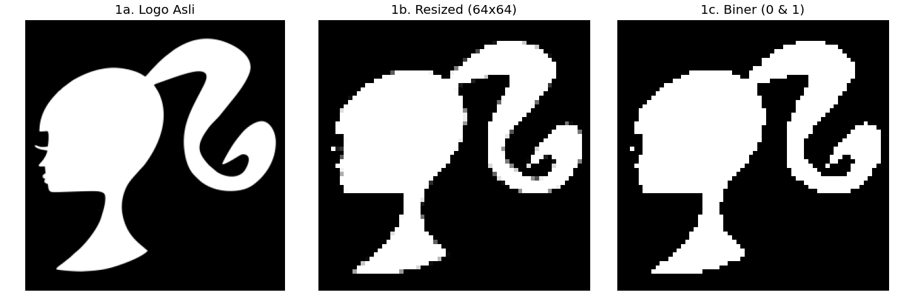
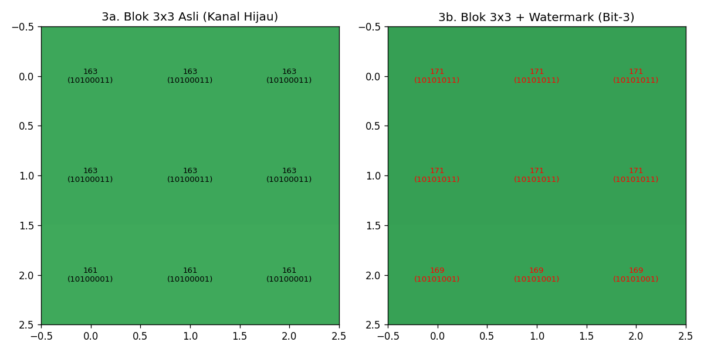
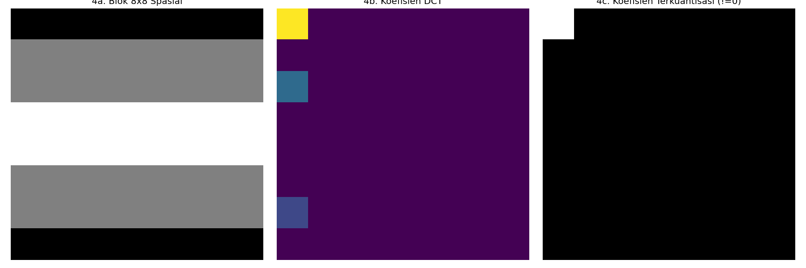
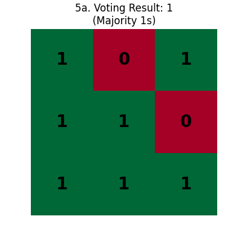

# Digital Image Watermarking: Robust LSB & JPEG DCT Simulation

Repositori ini mengimplementasikan sistem *Digital Image Watermarking* yang tangguh menggunakan metode **Robust LSB** dan simulasi kompresi JPEG berbasis **Discrete Cosine Transform (DCT)**. Proyek ini bertujuan untuk menyisipkan identitas digital ke dalam citra secara tidak kasat mata (*invisible*) namun tetap bertahan terhadap manipulasi kompresi.

---

## Quick Demo

Berikut adalah ringkasan hasil penyisipan dan ekstraksi watermark pada kondisi ideal:

| Citra Host (Original) | Watermark Logo | Citra Ter-watermark | Hasil Ekstraksi |
|:---:|:---:|:---:|:---:|
|  |  |  |  |

## Alur Kerja Sistem

Sistem ini mengikuti proses pipeline yang terbagi menjadi tahap *Embedding*, *Compressing* dan *Extraction*. Berikut adalah penjelasan visual tiap tahap:

### 1. Pre-processing & Binarization
Watermark logo asli dikonversi ke citra biner (0 dan 1). Hal ini dilakukan untuk meminimalkan data yang disisipkan dan memungkinkan penggunaan teknik *Voting* saat ekstraksi.

  
   <i>Proses transformasi logo Barbie asli: Grayscale -> Resize 64x64 -> Biner.</i>

### 2. Robust LSB Embedding & Redundancy
Sistem menggunakan **Bit ke-3** untuk penyisipan. Untuk meningkatkan ketahanan, setiap 1 bit watermark disebarkan ke dalam blok **3x3 piksel** (redundansi).

  
   <i>Analisis Pixel-Level: Perubahan nilai bit pada posisi ke-3 (merah) di kanal hijau citra face.jpeg.</i>

- **Kiri:** Nilai piksel asli beserta representasi binernya.
- **Kanan:** Nilai piksel setelah disisipkan bit '1' pada posisi ke-3. Perubahan nilai desimal sangat kecil sehingga tidak kasat mata.

### 3. JPEG Compression Attack (DCT Manual)
Untuk mensimulasikan serangan nyata, citra diproses dengan algoritma kompresi JPEG manual. Proses ini membuang informasi frekuensi tinggi (detail halus) yang biasanya merusak watermark LSB standar.

  
   <i>Analisis Domain Frekuensi: Transformasi blok 8x8 citra asli menjadi koefisien DCT dan hasil kuantisasinya.</i>

### 4. Extraction & Majority Voting
Saat ekstraksi, sistem membaca bit ke-3 dari setiap piksel dalam blok 3x3. Karena kompresi JPEG bisa mengubah nilai piksel secara acak, teknik **Majority Voting** digunakan untuk menentukan nilai bit yang paling mungkin.

  
   <i>Logika Voting: Jika mayoritas piksel dalam blok 3x3 memiliki bit-3 bernilai 1, maka hasil ekstraksi adalah 1.</i>

<i>Hasil pemulihan watermark setelah melewati berbagai tingkat kompresi.</i>

##  Evaluasi Performa

Ketahanan sistem diuji terhadap berbagai tingkat kompresi JPEG (*Quality Factor* 10 hingga 100).

### Perbandingan Ekstraksi vs QF
Semakin rendah QF, citra akan semakin terkompresi (ukuran file mengecil), namun tingkat kesalahan ekstraksi (BER) akan meningkat.

### Analisis Statistik
Metrik yang digunakan adalah **PSNR** (kualitas visual citra) dan **BER** (tingkat kesalahan bit).

  

Hasil visual ekstraksi watermark pada berbagai QF memperlihatkan pola degradasi yang konsisten dan dapat diamati langsung. Pada QF 100, watermark yang diekstrak tampak hampir identik dengan watermark aslinya meski terdapat sedikit noise dengan BER 0,0078. Pada QF 90 dan 80, mulai muncul derau berbentuk bintik-bintik acak yang menyebabkan sebagian detail tepi logo kabur, namun bentuk keseluruhan masih sangat jelas dikenali. Memasuki QF 70 dan 50, derau semakin menyebar dan mengaburkan detail halus, meski struktur utama watermark masih dapat terbaca dengan baik. Pada QF 30, degradasi terlihat cukup signifikan dengan banyak piksel yang salah, namun siluet keseluruhan masih bisa diidentifikasi. Pada QF 10 dengan BER 0,3384, watermark mengalami distorsi parah dan hampir tidak dapat dikenali.

Kurva BER vs Quality Factor menunjukkan tren peningkatan error yang konsisten seiring menurunnya QF, namun dengan kecepatan yang tidak seragam. Pada rentang QF 100 hingga 70, kenaikan BER relatif landai — dari 0,0078 hingga 0,1152 — mengindikasikan bahwa sistem masih mampu mempertahankan sebagian besar bit watermark meskipun kompresi semakin agresif. Lonjakan BER yang lebih tajam baru terjadi saat QF turun ke 50 dan seterusnya.
Di sisi lain, kurva PSNR vs Quality Factor memperlihatkan penurunan yang lebih dramatis, khususnya pada transisi QF 70 ke QF 50 di mana PSNR turun dari 44,71 dB menjadi 34,54 dB — selisih sekitar 10 dB dalam satu langkah. Penurunan ini mencerminkan agresivitas kuantisasi DCT yang mulai merusak informasi pada bit-bit yang lebih tinggi, termasuk bit ke-3 tempat watermark disisipkan.
Secara keseluruhan, sistem menunjukkan performa yang layak untuk penggunaan praktis pada QF 70 ke atas, di mana BER masih berada di bawah 12% dan watermark masih terbaca dengan jelas secara visual.

### Kesimpulan
Sistem watermarking yang dibangun berhasil menyisipkan citra biner ke dalam foto wajah berwarna menggunakan metode Robust LSB dengan simulasi kompresi JPEG berbasis DCT manual. Evaluasi dilakukan dengan memvariasikan Quality Factor (QF) dari 100 hingga 10 untuk mengukur ketahanan watermark terhadap kompresi.
Hasil pengujian menunjukkan bahwa watermark masih dapat diekstrak dengan baik pada rentang QF 70 hingga 100, di mana BER berada di bawah 12% dan bentuk watermark masih dapat dikenali secara visual. Penurunan kualitas mulai terasa signifikan pada QF 50 dengan BER 0,1582, dan semakin parah pada QF 30 meski watermark masih samar terbaca. Watermark dinyatakan tidak dapat diekstrak secara memuaskan pada QF 10, di mana BER mencapai 0,3384 (1.386 bit error) dan hasil visual watermark sudah terdistorsi parah hingga tidak dapat dikenali.
Dengan demikian, sistem ini efektif digunakan pada kondisi kompresi JPEG dengan QF di atas 30, yang mencakup sebagian besar skenario penggunaan nyata. QF 10 menjadi batas kritis di mana kompresi terlalu agresif sehingga watermark tidak lagi dapat dipulihkan.
