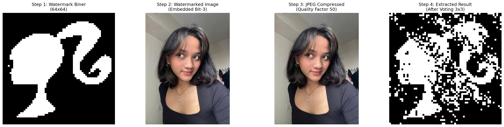
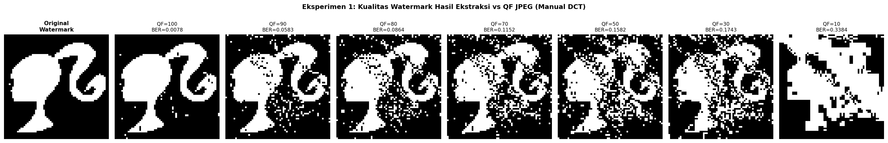
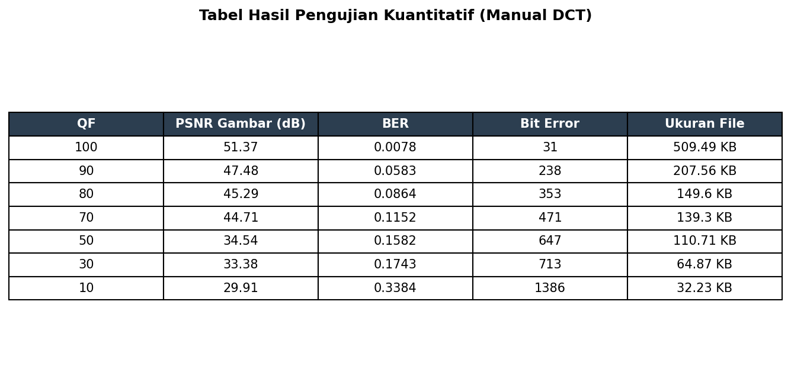
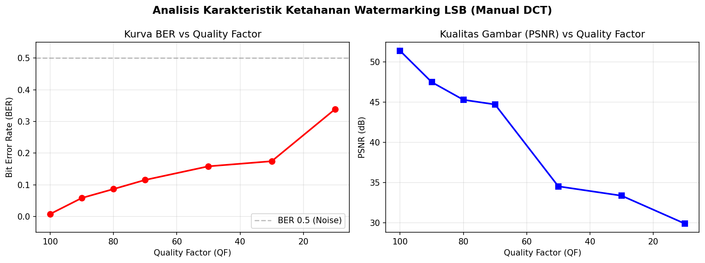

# Laporan Tugas Watermarking - II2240 Sistem Multimedia

Repositori ini berisi laporan lengkap dan implementasi teknik *Digital Watermarking* menggunakan metode **Robust LSB (Least Significant Bit)** yang dioptimasi untuk ketahanan terhadap kompresi JPEG.

## Informasi Mahasiswa
- **Nama:** Nadine Arindy Octavia
- **NIM:** 18224012
- **Mata Kuliah:** II2240 Sistem Multimedia
- **Instansi:** Institut Teknologi Bandung

---

## 1. Pendahuluan
Dalam era digital, perlindungan hak cipta konten multimedia menjadi krusial. *Digital watermarking* hadir sebagai solusi untuk menyisipkan informasi identitas ke dalam media digital. Tantangan utama bagi metode spasial seperti LSB adalah kerentanannya terhadap manipulasi gambar, terutama kompresi *lossy* seperti JPEG.

### Tujuan Eksperimen
1. Mengimplementasikan algoritma LSB dengan optimasi posisi bit dan redundansi.
2. Menganalisis korelasi antara *Quality Factor* JPEG dengan kualitas visual gambar (PSNR) dan integritas watermark (*Bit Error Rate* - BER).

---

## 2. Alur Kerja Step-by-Step

Berikut adalah visualisasi transformasi data dari tahap awal hingga akhir:

### Tahap 1: Persiapan & Prapemrosesan
Sebelum data disisipkan, dilakukan pengolahan pada citra host dan logo watermark:
1.  **Host Image Loading:** Citra `face.jpeg` dibaca dalam format RGB.
2.  **Watermark Binarization:** Logo `barbie_logo.png` dikonversi ke grayscale, di-*resize* ke 64x64, lalu diubah menjadi **Citra Biner** (0 dan 1) menggunakan thresholding.
    - *Alasan:* Citra biner meminimalkan jumlah data yang harus disisipkan dan memungkinkan penggunaan teknik voting.
3.  **Channel Selection:** Memilih **Kanal Hijau (Green)** dari citra host.
    - *Alasan:* Kanal hijau memiliki kontribusi tertinggi pada komponen pencahayaan (Luminance) yang lebih dipertahankan saat kompresi JPEG dibanding kanal biru atau merah.

### Tahap 2: Proses Embedding (Penyisipan)
Pada tahap ini, bit watermark dimasukkan ke dalam citra menggunakan metode **Robust LSB**:
1.  **Bit-Plane Shifting:** Informasi bit disisipkan pada **bit ke-3** (LSB biasanya bit 0).
    - *Logika:* `(pixel & ~(1 << 3)) | (bit << 3)`. Bit ke-3 lebih "tahan banting" terhadap pembulatan nilai akibat kompresi.
2.  **Spasial Redundancy (3x3 Block):** Setiap 1 bit dari watermark disebarkan ke dalam blok **3x3 piksel** pada citra host. Jadi, 1 bit informasi diwakili oleh 9 piksel.
    - *Hasil:* Menghasilkan `watermarked_BASE.png`. Secara visual, perubahan intensitas pada bit ke-3 sangat kecil sehingga tidak terdeteksi mata manusia.

### Tahap 3: Simulasi Kompresi JPEG (Serangan)
Untuk menguji ketahanan, citra yang telah di-watermark "diserang" dengan kompresi JPEG manual:
1.  **Blok 8x8:** Citra dipecah menjadi blok-blok 8x8 piksel.
2.  **DCT (Discrete Cosine Transform):** Mengubah data piksel dari domain spasial ke domain frekuensi.
3.  **Quantization:** Koefisien DCT dibagi dengan **Matriks Kuantisasi Standar** yang dikalikan dengan *Quality Factor* (QF). Di sinilah informasi bit rendah biasanya hilang.
4.  **IDCT:** Mengembalikan citra ke domain spasial. Proses ini menghasilkan degradasi kualitas sesuai nilai QF yang dipilih.

### Tahap 4: Proses Extraction (Pengambilan Kembali)
Tahap terakhir adalah mengambil kembali logo watermark dari citra yang sudah terkompresi:
1.  **Reading Bit-3:** Membaca nilai bit pada posisi ke-3 di setiap piksel dalam blok 3x3.
2.  **Majority Voting:** Melakukan "voting" pada blok 3x3 tersebut. Jika mayoritas (misal 5 dari 9 piksel) bernilai 1, maka bit watermark dianggap 1.
    - *Keunggulan:* Jika kompresi merusak 1 atau 2 piksel dalam blok, bit asli tetap bisa diselamatkan oleh piksel lainnya.
3.  **Reconstruction:** Menyusun kembali bit-bit hasil voting menjadi gambar logo 64x64.

---

## 3. Hasil Eksperimen & Analisis Visual

### 3.1 Perbandingan Visual (Embedding)
Berikut adalah perbandingan antara citra asli dan citra yang telah disisipi watermark. Secara visual (*imperceptibility*), perbedaan hampir tidak terlihat oleh mata manusia.

| Citra Sebelum Watermarking | Citra Sesudah Watermarking |
|:---:|:---:|
|  |  |

### 3.2 Uji Ketahanan terhadap Kompresi JPEG
Eksperimen dilakukan dengan mengompres citra hasil watermarking menggunakan berbagai *Quality Factor* (QF), mulai dari QF 100 (kualitas terbaik) hingga QF 10 (kompresi sangat tinggi).

#### Hasil Ekstraksi Watermark
Semakin rendah nilai QF, semakin banyak informasi yang hilang, namun berkat optimasi LSB, watermark tetap dapat dikenali hingga batas tertentu.

---

## 4. Analisis & Pembahasan

### 4.1 Data Kuantitatif (Tabel Evaluasi)
Analisis dilakukan menggunakan dua metrik utama:
- **PSNR (Peak Signal-to-Noise Ratio):** Mengukur kualitas visual citra (semakin tinggi semakin baik).
- **BER (Bit Error Rate):** Mengukur tingkat kesalahan ekstraksi watermark (semakin rendah semakin baik).

### 4.2 Analisis Grafik Metrik
Berdasarkan grafik di bawah, terlihat bahwa:
- **Kurva BER:** Mengalami kenaikan landai pada rentang QF 100-70, namun melonjak tajam saat QF turun di bawah 50.
- **Kurva PSNR:** Penurunan drastis terjadi saat transisi QF 70 ke 50, yang menunjukkan agresivitas kuantisasi DCT mulai merusak bit-bit yang lebih tinggi (termasuk bit ke-3).

---

## 5. Kesimpulan
1. Sistem watermarking berhasil menyisipkan citra biner ke dalam foto berwarna menggunakan metode **Robust LSB** dengan simulasi kompresi JPEG berbasis DCT manual.
2. Watermark dapat diekstrak dengan sangat baik pada rentang **QF 70 hingga 100** (BER < 12%).
3. Penurunan kualitas mulai terasa signifikan pada QF 50, dan watermark menjadi tidak terbaca (hancur) pada **QF 10**.
4. Sistem ini efektif digunakan pada kondisi kompresi JPEG dengan QF di atas 30, yang mencakup sebagian besar skenario penggunaan nyata.

---
*Laporan ini disusun sebagai bagian dari tugas mata kuliah Sistem Multimedia.*
